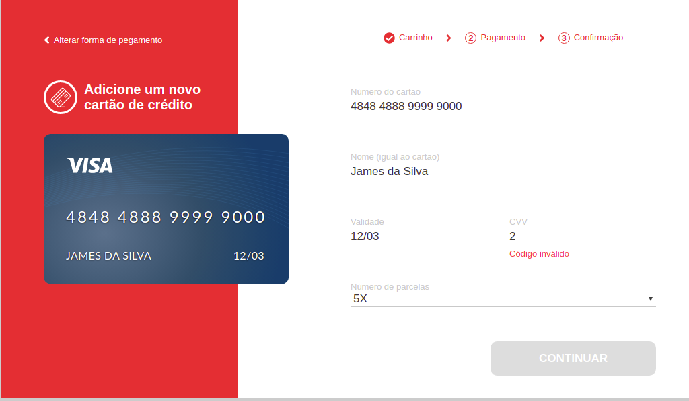

# Credit Cart Checkout

Interface React para realização de pagamento com cartão de créditos 

<div style="width: 100%; text-align:center"></div>

#### História de usuário:
- Eu como cliente,
- Quero usar meu cartão de crédito para realizar o pagamento
- Para conseguir realizar a compra

#### Cenário Feliz
- Dado que o usuário esteja na tela de pagamento,
- Quando ele preencher todos os campos do formulario com valores válidos
- O botão "continuar" deve ser habilitado

Para ver os cenários com mais detalhes, execute os testes de usuáro.

#### Executar testes de usuário automatizados
```
npm run e2e
```

#### Iniciar servidor de desenvolvimento
```
npm run start
```

#### Gerar build para produção
```
npm run build
```

#### Executar Back-End fake
```
npm run upfake
```

## Estrutura do projeto
A partir da raiz do projeto, temos quatro diretórios importantes:
- /assets: imagens e outros recursos da aplicação;
- /dist: arquivos de build prontos para implantação;
- /cypress: testes de usuário automatizados;
- /src: arquivos fontes 

No direório src, temos:
- O arquivo de entrada "entry.js";
- Uma pasta '/js/services' com requisições assíncronas;
- A pasta '/js/credit-card-checkout' com os componentes.

